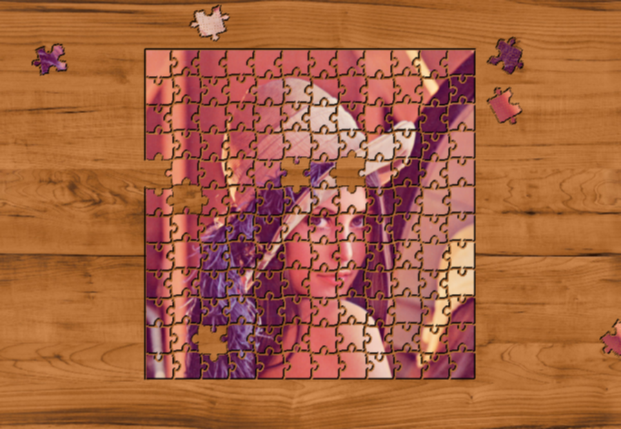
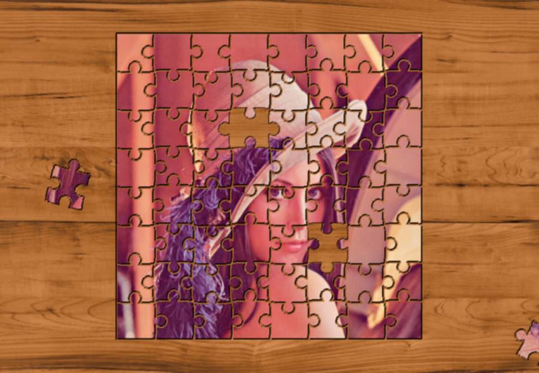

# Puzzle Effect Filter

## Implementation of a Puzzle Effect Filter for Images

### Authors

Ubiratan Neto, Pedro Vidal and João Rescala

### Usage

python3 -m run [-h] [-b] [-i] [-n] [-o] [-p] [-s] [-r]

+ -i : Path to the input image
+ -o : Path to save the output image (directory and name of the image). Always make sure that the directory exists
+ -b : Path to the background image. If not given, default white background is used
+ -n : Number of pieces to remove from their original position
+ -p : Size of the pieces. Number must be bigger or equal than 32. Generated pieces are squares with the given size
+ -s : Option to show a board for the user. With this option, the user can select exactly which pieces should be removed from the puzzle. The presence of the flag indicates that the user wants this option
+ -r : Seed for the random generator. Use this option to pass a seed and have reproducible results

Run 'python3 -m run -h' to see more informations 

### Examples

**Basic Example**
```
python3 -m run
```


**Removing 15 pieces** 

```
python3 -m run -n 15
```


**Add background and use piece size of 40x40 removing 5 pieces**

```
python3 -m run -n 5 -b examples/wooden_table.png -p 40
```



**Select and Remove pieces 26 and 45 from the puzzle**

```
python3 -m run -o examples/results/select2_back.png -n 2 -b examples/wooden_table.png -s
```


After the above image shows up, type:
```
26 45
```

The result is shown below




